# How to use Ledger Nano with Dock

## Introduction

The app is used to manage Dock's native tokens. The app can be used to transfer tokens, stake tokens as a validator or 
nominator and participate in governance by voting. The explorer is available [here](https://fe-staging.dock.io/?rpc=wss%3A%2F%2Fknox-1.dock.io#/explorer). We recommend using Ledger vs paper or browser wallet to individuals 
with a substantial amount of tokens. For any queries, send us an email at support.dock.io.

## Requirements
- 
- You have [initialized](https://support.ledger.com/hc/en-us/articles/360000613793) your Ledger Nano S
- The latest [firmware](https://support.ledger.com/hc/en-us/articles/360002731113-Update-Ledger-Nano-S-firmware) is installed.
- Ledger Live is [ready to use](https://support.ledger.com/hc/en-us/articles/360006395233-Take-your-first-steps).
- A web-browser is installed. We have tested with Google Chrome and Firefox.

## App Installation

1. Connect and unlock your Ledger Nano S.
2. Open the Manager in Ledger Live.
3. Allow the manager on your device by pressing both buttons.
4. Find **Dock** in the app catalog. You will see 2 apps, **Dock** and **Dock XL**. **Dock XL** is a bigger app and has advanced features like democracy while **Dock** is a smaller app and contains basic features like balance transfer and staking.
5. Click the **Install** button of the app.
6. An installation window appears on Ledger Live.
7. It will take a minute to install the app on your device. Enter the PIN id asked.
8. The app installation is confirmed and you can see the Dock app.

## Connecting to the web-app

To use any feature of the app, it first needs to be connected to [our webapp](https://fe-staging.dock.io/?rpc=wss%3A%2F%2Fknox-1.dock.io). Below are the instructions
1. Connect your Ledger device and open 
2. Go to [Settings tab of the webapp](https://fe-staging.dock.io/?rpc=wss%3A%2F%2Fknox-1.dock.io#/settings).
3. From the dropdown "manage hardware connections", select option "Attach Ledger via WebUSB" and click **Save** button on the bottom right as shown below
   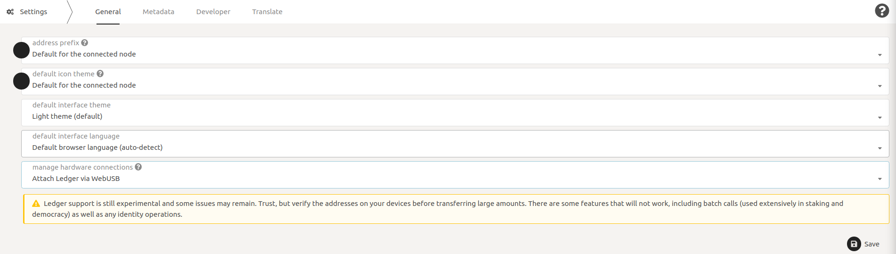
4. To confirm that connection was successful, go to the [Accounts tab](https://fe-staging.dock.io/?rpc=wss%3A%2F%2Fknox-1.dock.io#/accounts) and check whether **Add via Ledger** button is present on top-right of the page.
   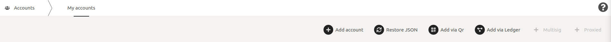

## Accounts

This section describes how to add accounts or view existing accounts.

### Adding a new account

1. Connect you Ledger device and open the Dock (or Dock XL) app. You will see text "Dock Ready"
2. Go to the [accounts page](https://fe-staging.dock.io/?rpc=wss%3A%2F%2Fknox-1.dock.io#/accounts) and click the **Add via Ledger** button.
3. This will open a modal as show below. Enter a name for the account and select a derivation path. In the example below, I have given the account name as "Ledger 0 0" and 
selected 0 for both derivation path
   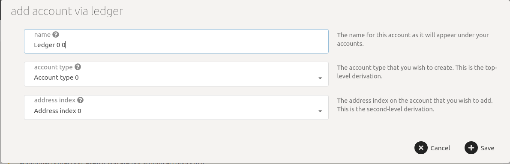
4. After clicking Save button on above modal, the account will be shown as a new row on the page as shown in the example below.
   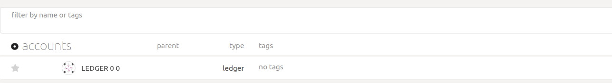

### Loading an existing account

If you have an existing account and want to load in the webapp to its details like balance, the steps are same as those for adding new account. However, they are given below.

1. Connect you Ledger device and open the Dock (or Dock XL) app. You will see text "Dock Ready"
2. Go to the [accounts page](https://fe-staging.dock.io/?rpc=wss%3A%2F%2Fknox-1.dock.io#/accounts) and click the **Add via Ledger** button.
3. This will open a modal as show below. Enter a name for the account and select the derivation paths you had chosen while creating the account. 
In the example below, I have chosen name "My ledger" and both derivation paths as index 0.
   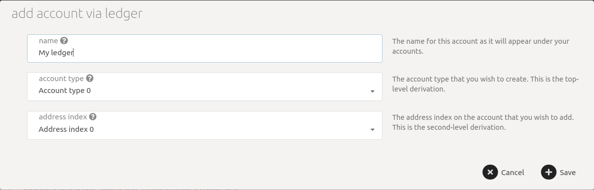
4. Your account is now added as new row. In the example below, you can see that my account has a balance of 10,045 tokens.
   

### View address on Ledger

To view the address of an account, whether new or existing, on the Ledger device, connect your Ledger app to the webapp first. 
Open the Dock app and load your account as described above. Once loaded follow steps below

1. Click the 3 dots to the end of the account's row, you will see a modal as below
   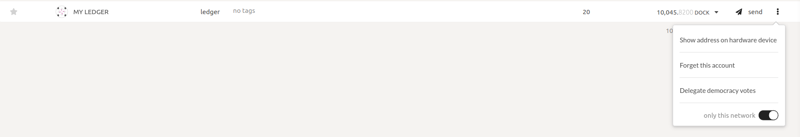
2. Click on "Show address on hardware device" and your Ledger will show the address. Since the address is big, it will be shown on 2 screens.
   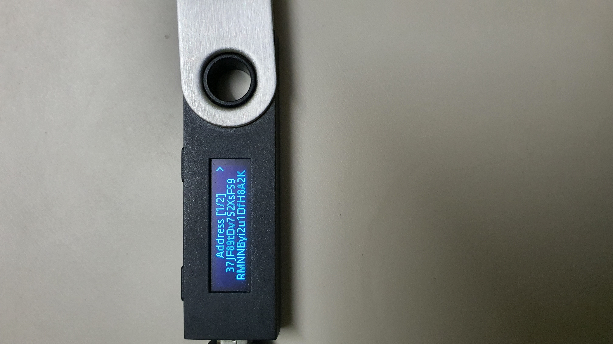
   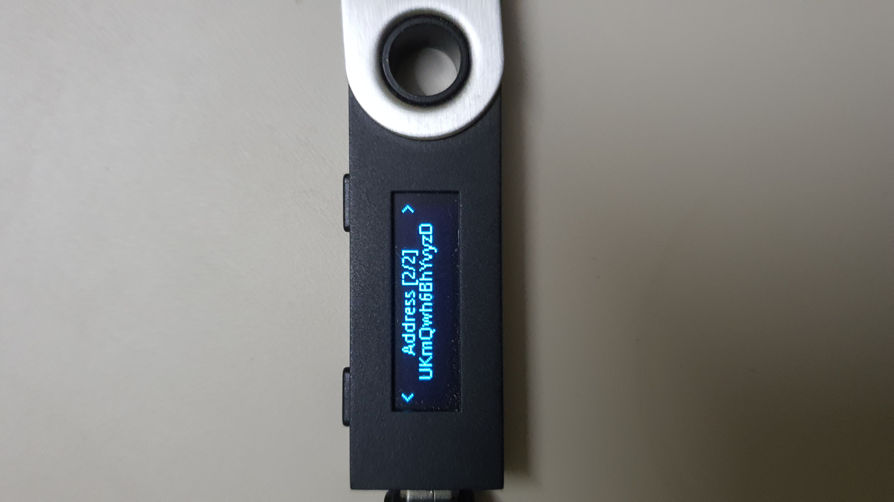

The address can now be shared with anyone to receive Dock tokens.

### Sending tokens

To transfer tokens, connect to your Ledger app to the webapp first. Open the Dock app and load your account as described above. Once loaded follow steps below.

1. Click the **Send** button to the end of the account's row, you will see a modal with title "send funds" as below
   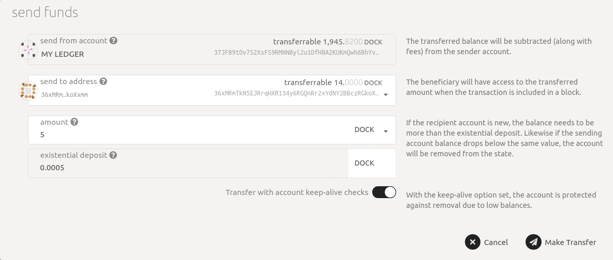
2. Now select the Ledger account in the "from" field and enter the destination in the "to" field and enter the amount. You will be able to see 
the balances of both sender and receiver. In the example below, I am sending 5 tokens from Ledger account named "My Ledger" 
to address "36xMRmTkN5EJRrqHXR134y6RGQnRr2xYdNY2BBczRGkoXxmm"
3. Click **Make Transfer** and you will see a confirmation dialog box which shows the sender account and transaction fees.
In the example below, the fees is 2.0650 DOCK tokens
   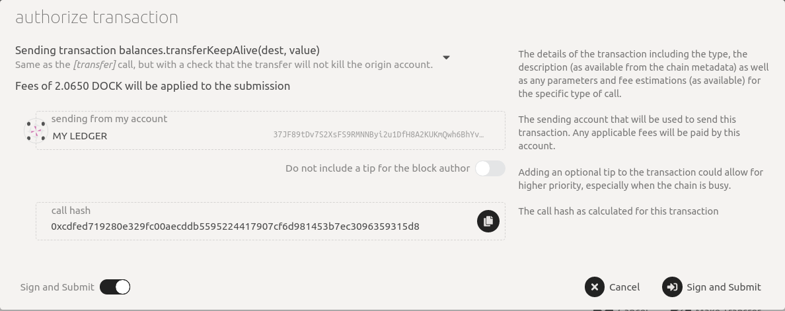
4. Click **Sign and Submit** button and now you will be able to see the transaction details on your Ledger device.
   In example below, the first screen shows that "Balances" module's "Transfer keep alive" function is called.
   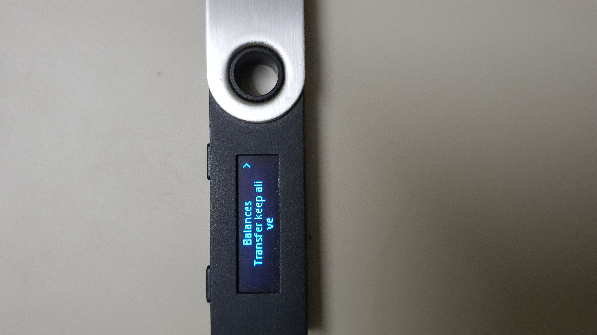
   
   On the next 2 screens, destination address is shown. Make sure the destination address is correct. Addresses are large so they always take 2 screens on Nano S. 
   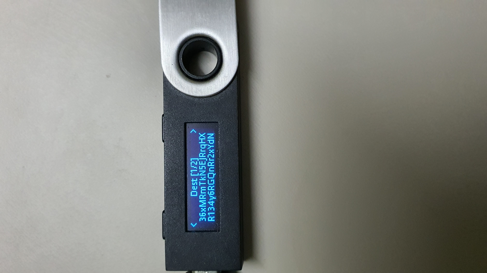

   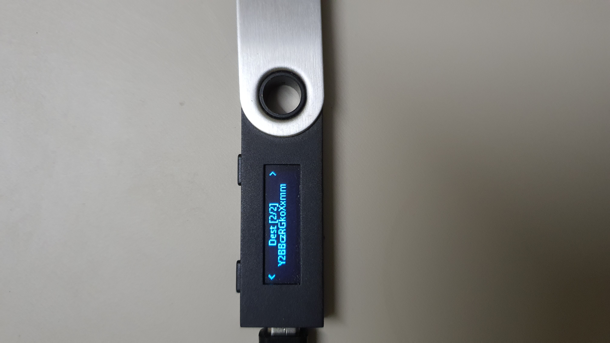

   On the next screen, amount of 5 DOCK tokens is shown. Make sure the amount is what you entered.
   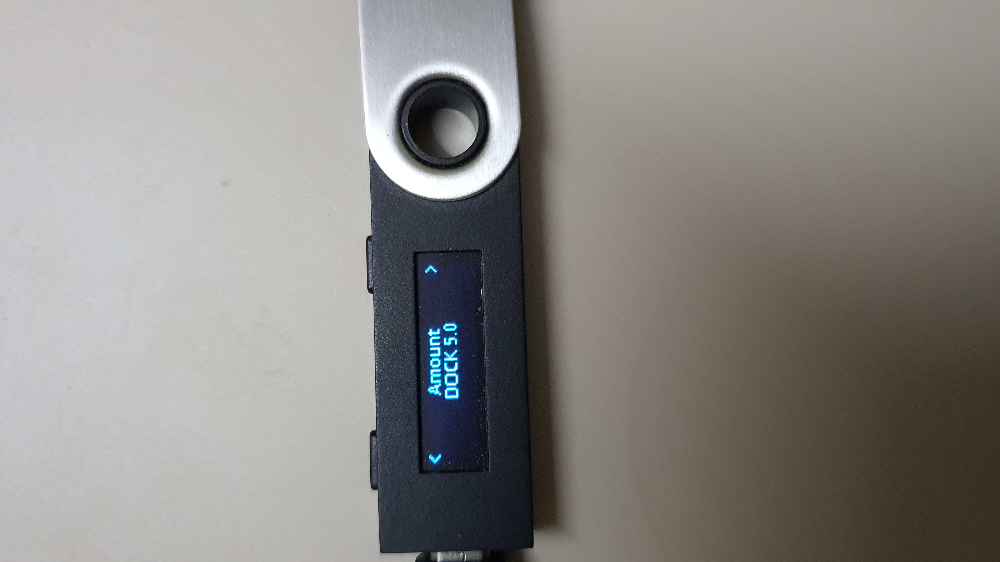
   
   On the next screen, "APPROVE" option is shown. Selecting it (by pressing both buttons on Nano S) will sign the transaction 
   and broadcast it to the network (via the webapp)
   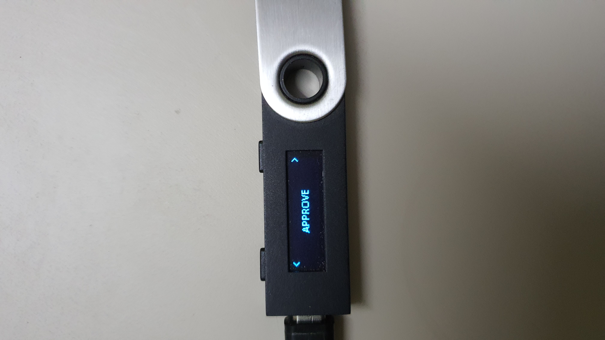

   You can also reject the transaction by selecting the "REJECT" option which is on the screen next to "APPROVE" option as shown below.
   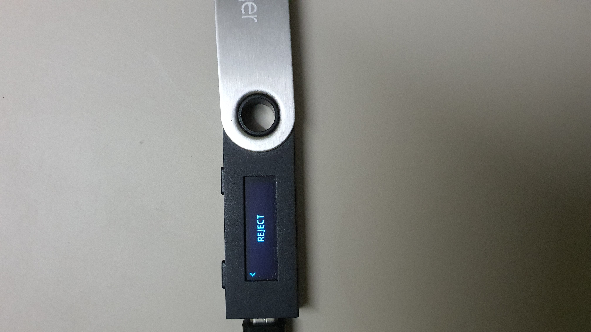

5. If you selected the "APPROVE" option, transaction will be broadcasted. Once the transaction is successful, you will see popups on top right of screen as shown below
   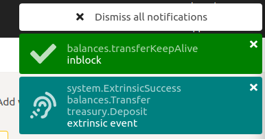

## Support
In case of any query, send us an email at support.dock.io or join our [Riot channel](https://app.element.io/#/room/#!KpPIERdKQjLTTwsOkn:matrix.org).